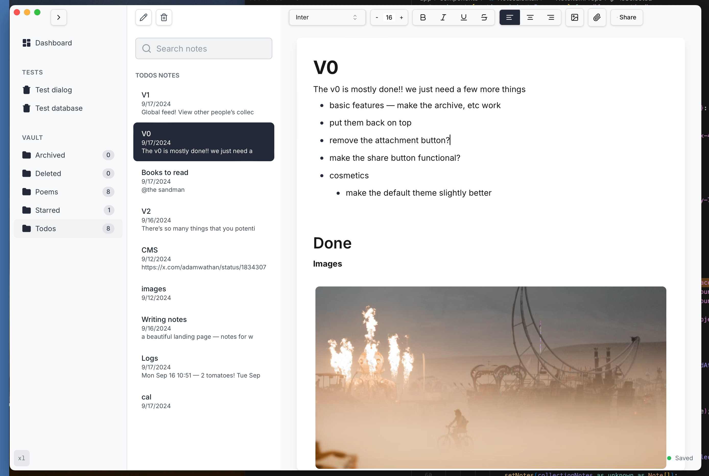
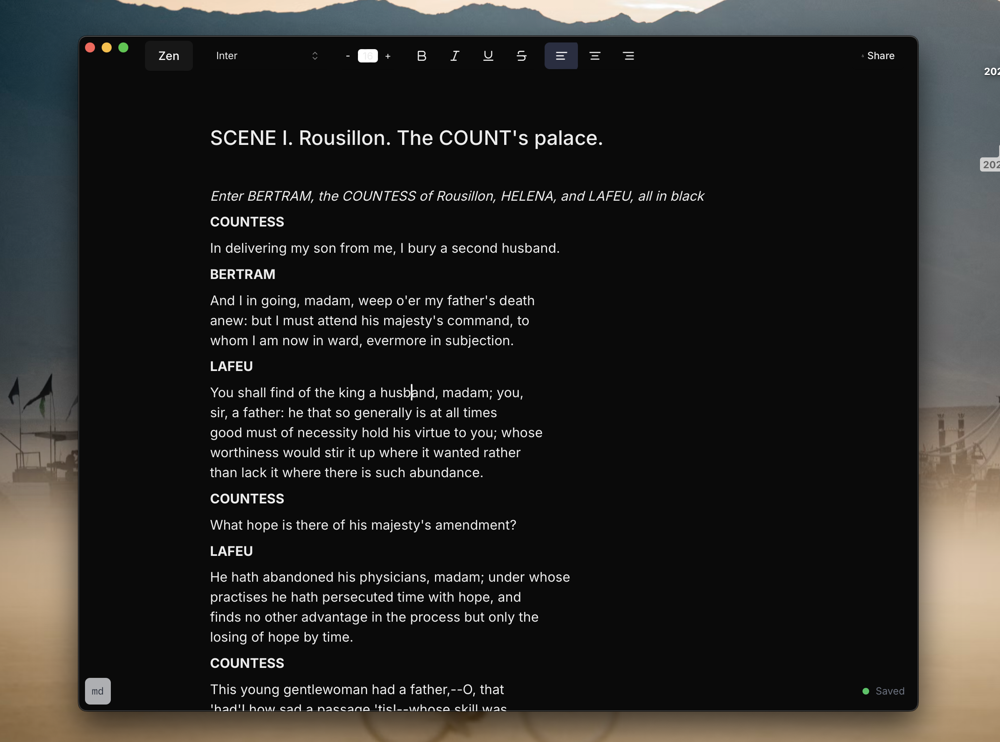

# Wordy - A Simple Text Editor

Light Mode

Dark Mode (also in Zen Mode)

## Taglines
- **Write with Ease, Publish with Confidence**
- **Your Writing, Simplified**
- **From Draft to Publish, All in One Place**

## About the App
Our text editor is designed to simplify the writing process, making it easier for you to focus on your content. Whether you're drafting a blog post, writing an article, or just jotting down notes, our editor provides a seamless and intuitive experience.

### Key Features
- **AI-Powered Assistance**: Leverage the power of AI to enhance your writing. Get suggestions, corrections, and improvements in real-time.
- **Zen Mode**: Eliminate distractions and immerse yourself in a focused writing environment with our Zen mode.
- **Publish Your Blog**: Easily publish your content directly from the editor to your blog. No need to switch between platforms.
- **Track Views**: Monitor the performance of your published content with built-in view tracking. See how your audience is engaging with your work.

Experience a new level of writing efficiency and creativity with our text editor. Start writing today and see the difference!

## Screenshots
